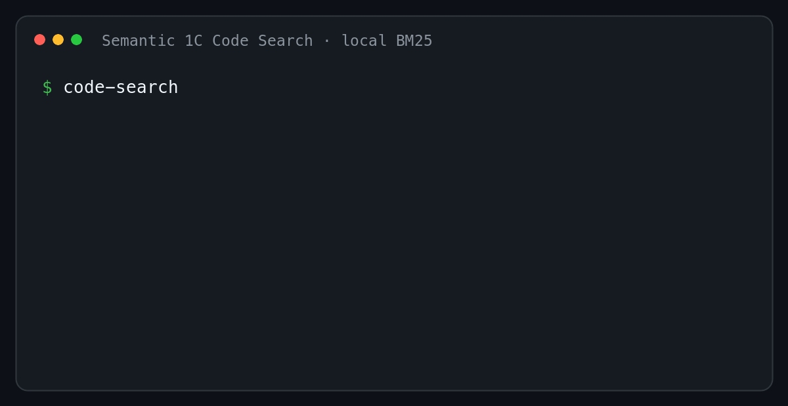

# Semantic 1C Code Search

English · [Русский](README.md)

[](https://github.com/sergey-lastochkin/semantic-1c-code-search/actions/workflows/ci.yml)
[](https://www.python.org/)
[](LICENSE)

**Search an exported 1C/BSL codebase locally: point the CLI at a directory and
enter a question or procedure name.** It recursively discovers `.bsl` files,
returns source modules and line ranges, and does not require a running 1C
platform.



## Quick start

### Windows PowerShell: prebuilt wheel

Clone the examples and install the prebuilt `v0.1.1` wheel:

```powershell
git clone --depth 1 https://github.com/sergey-lastochkin/semantic-1c-code-search.git
cd semantic-1c-code-search
py -3.11 -m venv .venv
.\.venv\Scripts\python.exe -m pip install "https://github.com/sergey-lastochkin/semantic-1c-code-search/releases/download/v0.1.1/1c_semantic_code_search-0.1.1-py3-none-any.whl"
.\.venv\Scripts\code-search.exe search examples "СформироватьНазначениеПлатежа"
```

The wheel requires no local project build. Its SHA-256 is published with the
[`v0.1.1` release](https://github.com/sergey-lastochkin/semantic-1c-code-search/releases/tag/v0.1.1).

### macOS and Linux: install from source

Clone the project and install the CLI:

```bash
git clone https://github.com/sergey-lastochkin/semantic-1c-code-search.git
cd semantic-1c-code-search
python3.11 -m venv .venv
.venv/bin/python -m pip install .
```

Try the bundled example:

```bash
.venv/bin/code-search search examples "СформироватьНазначениеПлатежа"
```

Search your own exported configuration:

```bash
.venv/bin/code-search search /path/to/config-export \
  "СформироватьНазначениеПлатежа"
```

The default BM25 engine is fast, requires no model, and makes no network
requests. Add `--json` for machine-readable output.

## Semantic mode

The optional hybrid engine combines BM25 and local embeddings with RRF:

```bash
.venv/bin/python -m pip install '.[embeddings]'

.venv/bin/code-search search /path/to/config-export \
  "validate available stock before posting" \
  --engine hybrid
```

`intfloat/multilingual-e5-small` is pinned to a specific revision. The first
hybrid run downloads it through `sentence-transformers`; inference is local
afterward. BSL source is never sent to a remote API.

| Engine | Best for | Extra setup |
| --- | --- | --- |
| `bm25` | Names, metadata, and exact terminology | None |
| `hybrid` | Natural-language questions | `.[embeddings]` and a model download |

## Included capabilities

- Recursive discovery of `.bsl` files.
- Procedure-aware chunks with source paths and line ranges.
- BM25, vector retrieval, and reciprocal rank fusion.
- Static call graphs exported as JSON, Mermaid, or DOT.
- JSON CLI output and a local FastAPI interface.
- In-memory, Qdrant local, FAISS, and pgvector adapters.

```bash
code-search graph /path/to/config-export --format mermaid
code-search index /path/to/config-export --out .code-search/index.json
```

## Reproducible benchmark

The benchmark uses 577 BSL files from three Apache-2.0 projects: 156,869 lines
and 7,342 procedures or functions. Source revisions and SHA-256 digests are
recorded in the [corpus manifest](studies/oss-bsl-corpus-2026-08-10/corpus-manifest.json).

- BM25 reached Recall@5 `0.855524` on 90 deterministic checks.
- On the manually reviewed Russian natural-language set, embeddings reached
  Recall@5 `0.344828`, compared with `0.137931` for BM25.
- RRF produced the best Recall@10 at `0.413793`, but did not win every metric.

[Method and results](docs/benchmark.md) ·
[corpus](docs/corpus.md) ·
[parser limitations](docs/parser-limits.md)

## Development

```bash
git clone https://github.com/sergey-lastochkin/semantic-1c-code-search.git
cd semantic-1c-code-search
python3.11 -m venv .venv
.venv/bin/python -m pip install -e '.[dev]'

.venv/bin/python -m pytest
.venv/bin/python -m ruff check src scripts tests
.venv/bin/python -m compileall -q src scripts tests
```

CI runs the same checks on Windows and Ubuntu with Python 3.11 and 3.12.

See [CONTRIBUTING.md](CONTRIBUTING.md) for contribution guidelines and useful
first issues.

## Limitations

- The parser is static and heuristic; it does not replace the 1C compiler or
  runtime.
- Dynamic dispatch, preprocessing, extension merge order, and constructed query
  strings may be incomplete.
- The benchmark corpus contains open-source libraries and test frameworks, not
  a commercial configuration.
- Retrieval quality depends on the export structure and query wording.

## License

[Apache License 2.0](LICENSE). Do not submit proprietary configurations,
personal data, credentials, or code you are not allowed to redistribute.
