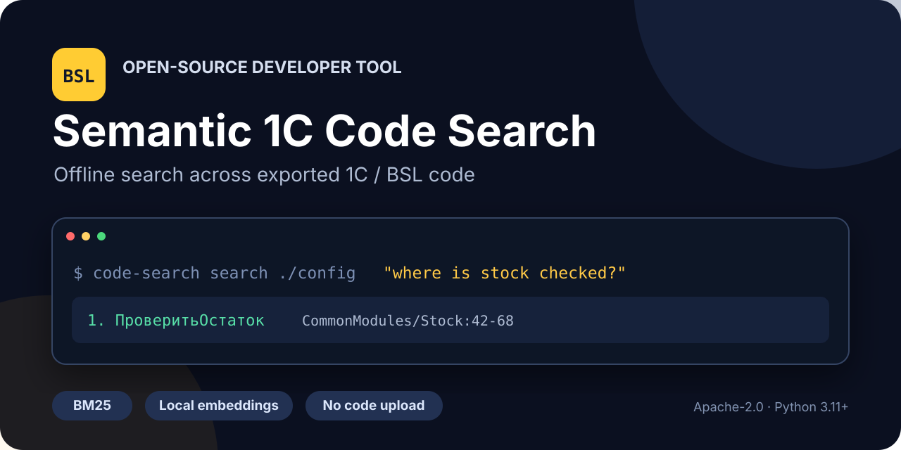

# Semantic 1C Code Search

[English](README.en.md) · Русский

[](https://github.com/sergey-lastochkin/semantic-1c-code-search/actions/workflows/ci.yml)
[](https://www.python.org/)
[](LICENSE)

**Локальный поиск по выгруженному BSL-коду: укажите каталог конфигурации и
задайте вопрос или имя процедуры.** Инструмент рекурсивно находит `.bsl`-файлы,
показывает исходный модуль и строки и не требует запущенной платформы 1С.



## Быстрый старт

Клонируйте проект и установите CLI:

```bash
git clone https://github.com/sergey-lastochkin/semantic-1c-code-search.git
cd semantic-1c-code-search
python3.11 -m venv .venv
.venv/bin/python -m pip install .
```

Проверка на небольшом примере:

```bash
.venv/bin/code-search search examples "СформироватьНазначениеПлатежа"
```

Пример результата:

```text
1. СформироватьНазначениеПлатежа  [payment_module:1-4]
   Функция СформироватьНазначениеПлатежа(Документ) Экспорт
```

Поиск по собственной выгрузке конфигурации:

```bash
.venv/bin/code-search search /path/to/config-export \
  "СформироватьНазначениеПлатежа"
```

По умолчанию используется быстрый BM25 без сетевых запросов и дополнительных
моделей. Для автоматизации добавьте `--json`.

## Семантический режим

Опциональный hybrid-режим объединяет BM25 и локальные embeddings через RRF:

```bash
.venv/bin/python -m pip install '.[embeddings]'

.venv/bin/code-search search /path/to/config-export \
  "проверка доступного остатка перед проведением" \
  --engine hybrid
```

Модель `intfloat/multilingual-e5-small` закреплена на конкретной revision. При
первом запуске `sentence-transformers` скачивает её, после чего вычисления идут
локально. Текст BSL не отправляется во внешний API.

| Режим | Когда использовать | Дополнительная установка |
| --- | --- | --- |
| `bm25` | Имена, реквизиты, точные термины | Нет |
| `hybrid` | Вопросы на естественном языке | `.[embeddings]` и загрузка модели |

## Что уже реализовано

- Рекурсивный поиск по каталогу `.bsl`-файлов.
- Разбиение модулей по процедурам и функциям с диапазонами строк.
- BM25, векторный поиск и объединение результатов через RRF.
- Статический граф вызовов в JSON, Mermaid или DOT.
- JSON-вывод для скриптов и локальный FastAPI-интерфейс.
- Адаптеры in-memory, Qdrant local, FAISS и pgvector.

```bash
code-search graph /path/to/config-export --format mermaid
code-search index /path/to/config-export --out .code-search/index.json
```

## Проверенный benchmark

Эксперимент воспроизводится на 577 BSL-файлах из трёх открытых Apache-2.0
проектов: 156 869 строк и 7 342 процедуры или функции. Источники, commit SHA и
SHA-256 сохранены в [манифесте корпуса](studies/oss-bsl-corpus-2026-08-10/corpus-manifest.json).

- На 90 детерминированных запросах BM25 получил Recall@5 `0.855524`.
- На вручную просмотренном наборе русских вопросов embeddings получили
  Recall@5 `0.344828` против `0.137931` у BM25.
- RRF получил лучший Recall@10 `0.413793`, но не выиграл все метрики.

[Методика и результаты](docs/benchmark.md) ·
[корпус](docs/corpus.md) ·
[границы парсера](docs/parser-limits.md)

## Разработка и проверки

```bash
git clone https://github.com/sergey-lastochkin/semantic-1c-code-search.git
cd semantic-1c-code-search
python3.11 -m venv .venv
.venv/bin/python -m pip install -e '.[dev]'

.venv/bin/python -m pytest
.venv/bin/python -m ruff check src scripts tests
.venv/bin/python -m compileall -q src scripts tests
```

Правила и хорошие первые задачи описаны в [CONTRIBUTING.md](CONTRIBUTING.md).

## Границы

- Парсер статический и эвристический; он не заменяет компилятор или запуск 1С.
- Динамическая диспетчеризация, препроцессор, расширения и вычисляемые строки
  могут быть видны не полностью.
- Benchmark построен на открытых библиотеках и тестовых фреймворках, а не на
  коммерческой конфигурации.
- Качество поиска зависит от структуры выгрузки и формулировки запроса.

## Лицензия

[Apache License 2.0](LICENSE). Не добавляйте в issues и pull requests закрытые
конфигурации, персональные данные или код без права на распространение.
