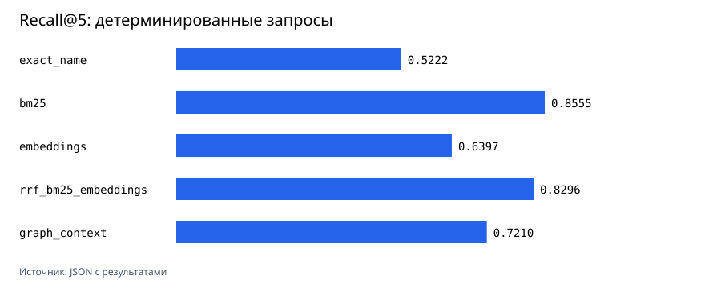

# Поиск по BSL-коду

Локальный поиск по выгрузке BSL с BM25, настоящими embeddings и статическим графом вызовов. Удалённый репозиторий пока называется `semantic-1c-code-search`; возможное переименование обсуждается отдельно.



Прогон сделан на 577 BSL-файлах из трёх открытых проектов Apache-2.0: 156869 строк и 7342 процедуры или функции. Источники, commit SHA и SHA-256 файлов сохранены в [манифесте корпуса](studies/oss-bsl-corpus-2026-08-10/corpus-manifest.json).

На 90 детерминированных проверках BM25 получил лучший Recall@5 `0.855524`. Реальная локальная модель `intfloat/multilingual-e5-small` дала `0.639668`, а RRF с BM25 поднял MRR@10 до `0.788470`. Это не подгонка: для точных имён и известных статических вызовов лексический поиск оказался сильнее.

Для 42 русских вопросов embeddings дали Recall@5 `0.404762` против `0.285714` у BM25. Их разметка пока `pending`, поэтому это эксперимент, а не итоговая метрика. Список вопросов и предлагаемая релевантность находятся в [JSON](evaluation/natural_language_queries.json) и [карточке проверки](evaluation/review-natural-queries.md).

[Корпус](docs/corpus.md) · [Методика и результаты](docs/benchmark.md) · [Границы парсера](docs/parser-limits.md)

## Как повторить прогон

```bash
python -m venv .venv
.venv/bin/pip install -e '.[dev,embeddings]'

PYTHONPATH=src .venv/bin/python scripts/fetch_corpus.py \
  --sources studies/oss-bsl-corpus-2026-08-10/sources.json \
  --target ../oss-bsl-corpus \
  --manifest studies/oss-bsl-corpus-2026-08-10/corpus-manifest.json

PYTHONPATH=src .venv/bin/python scripts/run_embedding_benchmark.py \
  --corpus ../oss-bsl-corpus \
  --sources studies/oss-bsl-corpus-2026-08-10/sources.json \
  --corpus-manifest studies/oss-bsl-corpus-2026-08-10/corpus-manifest.json \
  --natural-queries evaluation/natural_language_queries.json \
  --out studies/oss-bsl-corpus-2026-08-10/embedding-results.json \
  --device mps

PYTHONPATH=src .venv/bin/python scripts/render_charts.py \
  --results studies/oss-bsl-corpus-2026-08-10/embedding-results.json \
  --out studies/oss-bsl-corpus-2026-08-10/graphs
```

`fetch_corpus.py` делает checkout строго на commit SHA из `sources.json`. Исходный BSL-код в этот репозиторий не добавляется.

## Проверки

```bash
PYTHONPATH=src .venv/bin/python -m pytest
ruff check src scripts tests
PYTHONPATH=src .venv/bin/python -m compileall -q src scripts tests
```

## Границы

- Корпус состоит из открытых библиотек и тестовых фреймворков, а не из коммерческой конфигурации 1С.
- `multilingual-e5-small` зафиксирована на revision `614241f622f53c4eeff9890bdc4f31cfecc418b3`, имеет MIT-лицензию и размерность 384. В карточке модели нет заявления о Matryoshka training, поэтому усечения до 512, 256 и 128 не выдаются за Matryoshka experiment.
- Парсер статический и эвристический. BSL Language Server нашёл 7780 процедур и функций против 7342 у этого парсера; разница `-438` описана в [файле проверки](studies/oss-bsl-corpus-2026-08-10/bsl-language-server-validation.json).
- Динамическая диспетчеризация, вычисляемые строки запросов и работа платформы 1С не проверяются выполнением.
