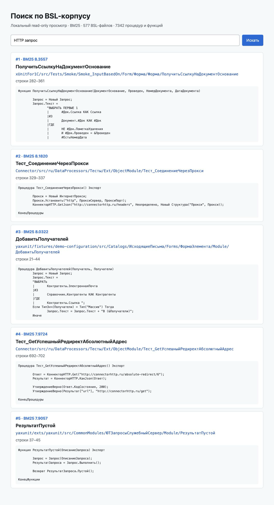

# Поиск по BSL-коду

[](https://github.com/sergey-lastochkin/semantic-1c-code-search/actions/workflows/ci.yml)

Локальный поиск по выгрузке BSL с BM25, настоящими эмбеддингами и статическим графом вызовов. Удалённый репозиторий пока называется `semantic-1c-code-search`; возможное переименование обсуждается отдельно.



Прогон сделан на 577 BSL-файлах из трёх открытых проектов Apache-2.0: 156869 строк и 7342 процедуры или функции. Источники, commit SHA и SHA-256 файлов сохранены в [манифесте корпуса](studies/oss-bsl-corpus-2026-08-10/corpus-manifest.json).

На 90 детерминированных проверках BM25 получил лучший Recall@5 `0.855524`. Реальная локальная модель `intfloat/multilingual-e5-small` дала `0.639668`, а RRF с BM25 поднял MRR@10 до `0.788470`. Это не подгонка: для точных имён и известных статических вызовов лексический поиск оказался сильнее.

Для V2 вручную просмотрены 42 русских вопроса и target-процедуры в закреплённом открытом корпусе: 29 вошли в метрики, 13 прямых name-level обёрток исключены с причиной. На reviewed V2 embeddings получили Recall@5 `0.344828` против `0.137931` у BM25; RRF получил лучший Recall@10 `0.413793`, но уступил embeddings на Recall@5 и MRR@10. Полный [V2 artifact](studies/oss-bsl-corpus-2026-08-11-reviewed-v2/README.md) содержит query source, source/corpus manifest, raw top-10 ranking каждой строки и графики. Старый [pending-набор](evaluation/natural_language_queries.json) сохранён как исторический эксперимент и не является итоговой метрикой.


[Корпус](docs/corpus.md) · [Методика и результаты](docs/benchmark.md) · [Границы парсера](docs/parser-limits.md)

## Как повторить прогон

```bash
python -m venv .venv
.venv/bin/pip install -e '.[dev,embeddings]'

PYTHONPATH=src .venv/bin/python scripts/fetch_corpus.py \
  --sources studies/oss-bsl-corpus-2026-08-10/sources.json \
  --target ../oss-bsl-corpus \
  --manifest studies/oss-bsl-corpus-2026-08-10/corpus-manifest.json

PYTHONPATH=src .venv/bin/python scripts/run_embedding_benchmark.py \
  --corpus ../oss-bsl-corpus \
  --sources studies/oss-bsl-corpus-2026-08-10/sources.json \
  --corpus-manifest studies/oss-bsl-corpus-2026-08-10/corpus-manifest.json \
  --natural-queries evaluation/reviewed_natural_language_queries_v2.json \
  --out studies/oss-bsl-corpus-2026-08-11-reviewed-v2/embedding-results.json \
  --device cpu

PYTHONPATH=src .venv/bin/python scripts/render_charts.py \
  --results studies/oss-bsl-corpus-2026-08-11-reviewed-v2/embedding-results.json \
  --out studies/oss-bsl-corpus-2026-08-11-reviewed-v2/graphs

PYTHONPATH=src .venv/bin/python scripts/serve_corpus_viewer.py \
  --corpus ../oss-bsl-corpus \
  --sources studies/oss-bsl-corpus-2026-08-10/sources.json
```

`fetch_corpus.py` делает checkout строго на commit SHA из `sources.json`. Исходный BSL-код в этот репозиторий не добавляется.

## Проверки

```bash
PYTHONPATH=src .venv/bin/python -m pytest
ruff check src scripts tests
PYTHONPATH=src .venv/bin/python -m compileall -q src scripts tests
```

Эти проверки работают только с кодом и малыми фикстурами из репозитория: они не скачивают корпус, не загружают модель эмбеддингов и не вызывают 1С.

## Границы

- Корпус состоит из открытых библиотек и тестовых фреймворков, а не из коммерческой конфигурации 1С.
- `multilingual-e5-small` зафиксирована на revision `614241f622f53c4eeff9890bdc4f31cfecc418b3`, имеет MIT-лицензию и размерность 384. В карточке модели нет заявления о Matryoshka training, поэтому усечения до 512, 256 и 128 не выдаются за Matryoshka experiment.
- Парсер статический и эвристический. BSL Language Server нашёл 7780 процедур и функций против 7342 у этого парсера; разница `-438` описана в [файле проверки](studies/oss-bsl-corpus-2026-08-10/bsl-language-server-validation.json).
- Динамическая диспетчеризация, вычисляемые строки запросов и работа платформы 1С не проверяются выполнением.
