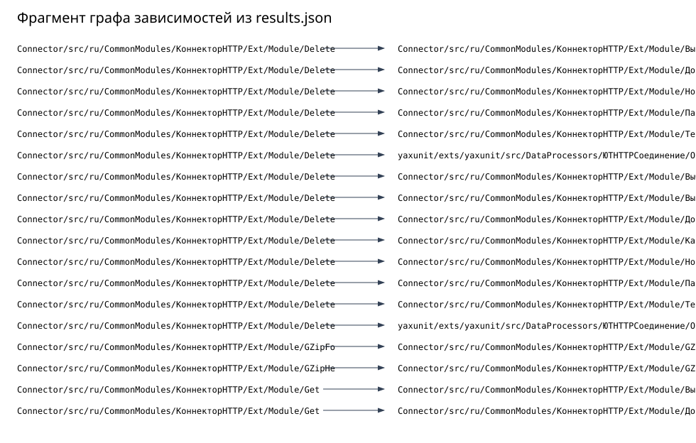
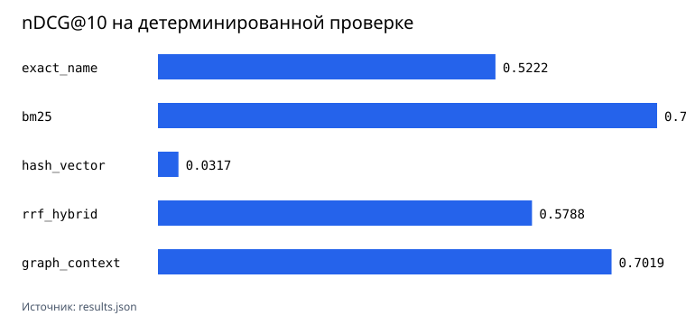
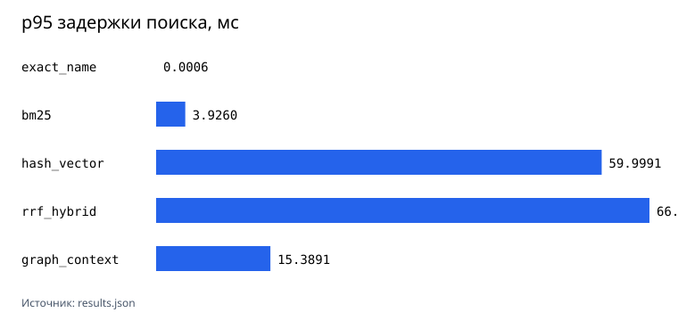

# 1C Code Intelligence

Рабочее имя проекта по поиску и анализу зависимостей в выгрузках BSL-кода. Удалённый репозиторий пока сохраняет старое имя `semantic-1c-code-search`: переименование или объединение репозиториев требует отдельного подтверждения.



Первый воспроизводимый запуск выполнен на 577 BSL-файлах из трёх открытых проектов под Apache-2.0. В корпусе 156869 строк; локальный статический парсер выделил 7342 процедуры и функции. Числа, commit SHA источников и SHA-256 каждого файла сохранены в [corpus-manifest.json](studies/oss-bsl-corpus-2026-08-10/corpus-manifest.json).

На 90 детерминированных проверках BM25 дал Recall@5 `0.855524`, MRR@10 `0.740384` и p95 `3.926` мс. Hash-vector baseline дал Recall@5 `0.005392` и p95 `59.9991` мс. Результат не замаскирован: текущий hash-vector не является семантической моделью и на этом корпусе хуже BM25. Все значения лежат в [results.json](studies/oss-bsl-corpus-2026-08-10/results.json).

[Корпус](docs/corpus.md) · [Методика и результаты](docs/benchmark.md) · [Ограничения парсера](docs/parser-limits.md)

## Что сравнивалось





| Метод | Recall@5 | MRR@10 | nDCG@10 | p50 / p95, мс | Построение, с | Размер сериализованного индекса, байт |
|---|---:|---:|---:|---:|---:|---:|
| `exact_name` | 0.522222 | 0.522222 | 0.522222 | 0.0003 / 0.0006 | 0.003106 | 5405069 |
| `bm25` | 0.855524 | 0.740384 | 0.772367 | 2.0067 / 3.926 | 0.200053 | 17575892 |
| `hash_vector` | 0.005392 | 0.029643 | 0.031717 | 46.6903 / 59.9991 | 1.067930 | 26776622 |
| `rrf_hybrid` | 0.683939 | 0.520891 | 0.578775 | 49.4140 / 66.4328 | 1.300795 | 34611739 |
| `graph_context` | 0.721039 | 0.609484 | 0.701878 | 14.2862 / 15.3891 | 0.365895 | 16799624 |

`graph_context` расширяет точные совпадения соседними процедурами из статического графа. Это отдельный способ просмотра связей, а не замена полнотекстового ранжирования.

## Как повторить прогон

```bash
python -m venv .venv
.venv/bin/pip install -e '.[dev]'

PYTHONPATH=src .venv/bin/python scripts/fetch_corpus.py \
  --sources studies/oss-bsl-corpus-2026-08-10/sources.json \
  --target ../oss-bsl-corpus \
  --manifest studies/oss-bsl-corpus-2026-08-10/corpus-manifest.json

PYTHONPATH=src .venv/bin/python scripts/run_benchmark.py \
  --corpus ../oss-bsl-corpus \
  --sources studies/oss-bsl-corpus-2026-08-10/sources.json \
  --corpus-manifest studies/oss-bsl-corpus-2026-08-10/corpus-manifest.json \
  --out studies/oss-bsl-corpus-2026-08-10/results.json

PYTHONPATH=src .venv/bin/python scripts/render_charts.py \
  --results studies/oss-bsl-corpus-2026-08-10/results.json \
  --out studies/oss-bsl-corpus-2026-08-10/graphs
```

Скрипт загрузки делает checkout строго на commit SHA из `sources.json`. Исходный BSL-код не коммитится в этот репозиторий.

## Проверки

```bash
PYTHONPATH=src .venv/bin/python -m pytest
ruff check src scripts tests
PYTHONPATH=src .venv/bin/python -m compileall -q src scripts tests
```

## Ограничения

- Корпус состоит из открытых библиотек и тестовых фреймворков, а не из коммерческой конфигурации 1С.
- Метрики относятся только к детерминированному набору: имена процедур, известные статические вызовы и ссылки на метаданные. Запросы на естественном языке пока не размечены человеком и не участвуют в итоговых числах.
- Локальный парсер статический и эвристический. BSL Language Server нашёл 7780 процедур и функций против 7342 у парсера этого проекта. Расхождение `-438` описано в [bsl-language-server-validation.json](studies/oss-bsl-corpus-2026-08-10/bsl-language-server-validation.json).
- Динамическая диспетчеризация, вычисляемые строки запросов и поведение платформы 1С не проверяются выполнением.
