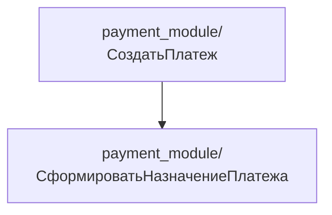

# Semantic 1C Code Search

[English](README.en.md) · Русский

[](https://github.com/sergey-lastochkin/semantic-1c-code-search/actions/workflows/ci.yml)
[](https://www.python.org/)
[](LICENSE)
[](https://github.com/sergey-lastochkin/semantic-1c-code-search/releases/latest)

**Локальный поиск по выгруженному коду 1С (BSL).** Укажите каталог выгрузки
конфигурации и спросите словами или именем процедуры — получите модуль,
процедуру и номера строк. Платформа 1С не нужна, код никуда не отправляется.


<sub>Настоящая запись CLI на открытом корпусе из бенчмарка. Как перезаписать —
[scripts/demo](scripts/demo/README.md).</sub>

## Какую проблему решает

В типовой конфигурации десятки тысяч процедур. Поиск в Конфигураторе и `grep`
выдают все строки с совпадением без ранжирования: даже в небольшом корпусе из
бенчмарка слово «таймаут» встречается 69 раз в 10 файлах, и разбирать их
приходится вручную. Инструмент
разбивает модули на процедуры и функции и ранжирует их целиком — по имени,
параметрам, переменным, комментариям и строкам внутри. В ответ приходит
короткий список процедур с путём к модулю и номерами строк. Режим `hybrid`
добавляет локальную языковую модель для вопросов обычными словами.

## Для кого

- 1С-разработчики, которые пришли в чужую или давно не открывавшуюся конфигурацию.
- Тимлиды и аудиторы, которым нужно быстро найти все места, связанные с оплатой,
  обменом или конкретным регистром, до оценки доработки.
- Команды, которым нельзя отправлять код во внешние AI-сервисы: поиск работает
  офлайн.

## Запуск за 2 минуты

### Windows PowerShell — готовый wheel

```powershell
git clone --depth 1 https://github.com/sergey-lastochkin/semantic-1c-code-search.git
cd semantic-1c-code-search
py -3.11 -m venv .venv
.\.venv\Scripts\python.exe -m pip install "https://github.com/sergey-lastochkin/semantic-1c-code-search/releases/download/v0.1.1/1c_semantic_code_search-0.1.1-py3-none-any.whl"
.\.venv\Scripts\code-search.exe search examples "СформироватьНазначениеПлатежа"
```

SHA-256 wheel опубликован в [релизе `v0.1.1`](https://github.com/sergey-lastochkin/semantic-1c-code-search/releases/tag/v0.1.1).

### macOS и Linux — из исходников

```bash
git clone https://github.com/sergey-lastochkin/semantic-1c-code-search.git
cd semantic-1c-code-search
python3.11 -m venv .venv
.venv/bin/python -m pip install .
.venv/bin/code-search search examples "СформироватьНазначениеПлатежа"
```

### На своей конфигурации

Выгрузите конфигурацию в файлы (Конфигуратор → «Выгрузить конфигурацию в файлы»
или EDT) и укажите каталог:

```bash
code-search search /path/to/config-export "таймаут соединения" --k 5
code-search search /path/to/config-export "basic авторизация" --json   # для скриптов
```

## Пример результата

Запрос на открытом корпусе из 577 BSL-файлов (тот же, что в ролике выше):

```text
$ code-search search corpus 'таймаут соединения' --k 3
1. Таймаут  [Connector/src/ru/CommonModules/КоннекторHTTP/Ext/Module:2035-2047]
   Функция Таймаут(ДополнительныеПараметры)

2. УстановитьТаймаут  [yaxunit/tests/src/CommonModules/Обр_ЮТHTTPСоединение_МО/Module:175-187]
   Процедура УстановитьТаймаут() Экспорт

3. КонструкторПоУмолчанию  [yaxunit/tests/src/CommonModules/Обр_ЮТHTTPСоединение_МО/Module:187-264]
   Процедура КонструкторПоУмолчанию() Экспорт
```

Статический граф вызовов для визуализации:

```bash
code-search graph examples --format mermaid
```


```mermaid
graph TD
  A["payment_module/СоздатьПлатеж"] --> B["payment_module/СформироватьНазначениеПлатежа"]
```

## Два режима поиска

| Режим | Когда использовать | Установка |
| --- | --- | --- |
| `bm25` (по умолчанию) | Имена, реквизиты, термины из кода | Ничего дополнительно |
| `hybrid` | Вопросы обычными словами | `pip install '.[embeddings]'`, модель скачивается один раз |

`hybrid` объединяет BM25 и локальную модель `intfloat/multilingual-e5-small`
(закреплённая revision) через RRF. Модель скачивается при первом запуске, дальше
всё считается локально.

Также есть: сохранение индекса (`code-search index`), локальный FastAPI-интерфейс,
адаптеры in-memory, Qdrant local, FAISS и pgvector.

## Бенчмарк

Корпус — 577 BSL-файлов из трёх открытых Apache-2.0 проектов (Connector,
YAxUnit, xUnitFor1C): 156 869 строк, 7 342 процедуры и функции. Commit SHA и
SHA-256 каждого файла — в [манифесте](studies/oss-bsl-corpus-2026-08-10/corpus-manifest.json).

| Набор запросов | BM25 | Embeddings | RRF |
| --- | ---: | ---: | ---: |
| 90 детерминированных (имена, вызовы, метаданные), Recall@5 | **0.856** | 0.640 | 0.830 |
| 29 вопросов на русском после ручной проверки, Recall@5 | 0.138 | **0.345** | 0.276 |
| Те же 29 вопросов, Recall@10 | 0.207 | 0.379 | **0.414** |

Честный вывод: по именам BM25 почти всегда находит нужное в топ-5; на вопросах
обычными словами embeddings лучше в 2,5 раза, но нужная процедура попадает в
топ-5 примерно в трети случаев. Набор из 29 вопросов маленький — это ориентир, а
не окончательная оценка. [Методика и полные таблицы](docs/benchmark.md) ·
[корпус](docs/corpus.md).

## Ограничения

- Парсер статический и эвристический: не заменяет компилятор или запуск 1С.
- Динамические вызовы (`Выполнить`, вычисляемые имена), препроцессор и
  расширения видны не полностью — см. [границы парсера](docs/parser-limits.md).
- Бенчмарк построен на открытых библиотеках, а не на типовой коммерческой
  конфигурации.
- BM25 ищет по целым словам без морфологии и без разбиения `ИменСоставныхИдентификаторов`:
  «таймаута» не найдёт «таймаут». Для таких запросов нужен `hybrid`.
- Нужен Python 3.11+; отдельного `.exe` пока нет.

## Разработка

```bash
.venv/bin/python -m pip install -e '.[dev]'
.venv/bin/python -m pytest
.venv/bin/python -m ruff check src scripts tests
```

CI гоняет эти проверки на Windows и Ubuntu, Python 3.11 и 3.12. Как помочь —
[CONTRIBUTING.md](CONTRIBUTING.md). Не прикладывайте к issues закрытые
конфигурации и персональные данные.

## Автор и контакты

Сергей Ласточкин — интеграции и автоматизация вокруг 1С и Python.
Нужно внедрить поиск по вашей конфигурации, разобраться в чужом коде или
сделать интеграцию 1С с внешним сервисом — пишите в Telegram
[@metaanswer](https://t.me/metaanswer).

Лицензия: [Apache 2.0](LICENSE).
