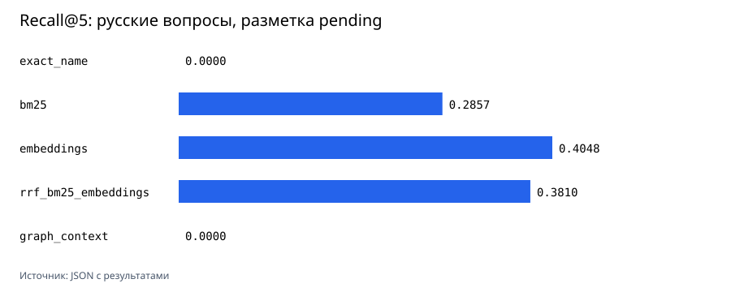

# Методика сравнительного прогона

В [embedding-results.json](../studies/oss-bsl-corpus-2026-08-10/embedding-results.json) сохранены модель, revision, размерность, хэши корпуса и наборов вопросов, commit кода, Python, параметры машины, время и размер индекса. Графики строит только `scripts/render_charts.py` из этого JSON.

## Наборы вопросов

`benchmark-queries.jsonl` содержит 90 детерминированных проверок: по 30 точных имён процедур, известных статических вызовов и ссылок на метаданные. У каждой проверки известен ожидаемый фрагмент BSL-кода.

В [natural_language_queries.json](../evaluation/natural_language_queries.json) находятся 42 вопроса на русском. Они похожи на вопросы разработчика про HTTP, JSON, документы, справочники и регистры. Предлагаемые процедуры пока имеют `review_status: pending`; их можно подтвердить или исправить в [карточке проверки](../evaluation/review-natural-queries.md). Поэтому метрики этого набора экспериментальные.

Для каждого метода считаются Recall@1, Recall@5, Recall@10, MRR@10, nDCG@10, время построения, размер индекса и p50/p95 поиска. Для embeddings размер индекса равен размеру матрицы `float32`; для остальных методов записан размер сериализованного Python-объекта. Это сравнение внутри одного прогона, не оценка серверного хранилища.

## Локальная модель

Сначала запущен небольшой отбор на 20 русских вопросах и фрагментах HTTP-коннектора. [Результат](../studies/oss-bsl-corpus-2026-08-10/model-selection-smoke.json): `intfloat/multilingual-e5-small` получил Recall@5 `0.500000`, а `sentence-transformers/paraphrase-multilingual-MiniLM-L12-v2` – `0.200000`. Разметка там тоже `pending`, поэтому выбор модели опирается на воспроизводимый сигнал, но не выдаётся за окончательную экспертную оценку.

Выбрана `intfloat/multilingual-e5-small`, revision `614241f622f53c4eeff9890bdc4f31cfecc418b3`, MIT, 384 измерения. Индексация и поиск выполняются локально через SentenceTransformers с префиксами `passage: ` и `query: `. Карточка модели не заявляет Matryoshka training, поэтому сравнения 512, 256 и 128 здесь нет.

## Результат

| Набор | Метод | Recall@5 | MRR@10 | p95, мс | Размер индекса |
|---|---|---:|---:|---:|---:|
| Детерминированный | BM25 | 0.855524 | 0.740384 | 4.6854 | 16.8 MiB |
| Детерминированный | embeddings | 0.639668 | 0.608730 | 27.7605 | 10.8 MiB |
| Детерминированный | BM25 + embeddings через RRF | 0.829589 | 0.788470 | 21.3353 | 27.5 MiB |
| Русские вопросы, `pending` | BM25 | 0.285714 | 0.166799 | 16.9175 | 16.8 MiB |
| Русские вопросы, `pending` | embeddings | 0.404762 | 0.291100 | 21.2184 | 10.8 MiB |
| Русские вопросы, `pending` | BM25 + embeddings через RRF | 0.380952 | 0.260034 | 34.9400 | 27.5 MiB |

На детерминированных проверках BM25 лучше на Recall@5. На pending-вопросах на русском embeddings выходят вперёд. RRF даёт лучший MRR@10 в первом наборе, но уступает embeddings во втором. `graph_context` полезен для перехода к соседним статическим процедурам, но не ранжирует вопросы на естественном языке.

Старый `hash_vector` сохранён в [results.json](../studies/oss-bsl-corpus-2026-08-10/results.json) как дешёвый лексический baseline. Он не является embedding-моделью и в новые графики не входит.
