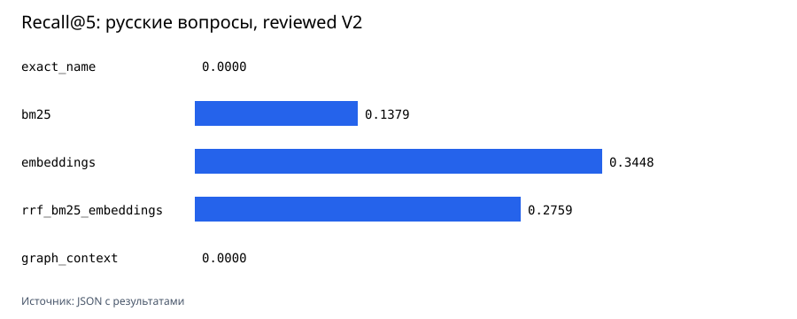

# Методика сравнительного прогона

Итоговый reviewed-прогон V2 сохранён в [embedding-results.json](../studies/oss-bsl-corpus-2026-08-11-reviewed-v2/embedding-results.json). В нём есть модель, revision, размерность, хэши корпуса и наборов вопросов, commit кода, Python, параметры машины, время и размер индекса. [Raw ranking](../studies/oss-bsl-corpus-2026-08-11-reviewed-v2/natural-language-query-rankings.jsonl) фиксирует top-10 каждого метода и expected path для каждого reviewed-вопроса. Графики строит только `scripts/render_charts.py` из этого JSON.

## Наборы вопросов

`benchmark-queries.jsonl` содержит 90 детерминированных проверок: по 30 точных имён процедур, известных статических вызовов и ссылок на метаданные. У каждой проверки известен ожидаемый фрагмент BSL-кода.

В [V2 JSON](../evaluation/reviewed_natural_language_queries_v2.json) зафиксированы 42 русских вопроса и результат source-review. 29 строк имеют `review_status: reviewed` и expected source paths; 13 прямых обёрток HTTP-методов и одношаговых диспетчеров имеют `review_status: excluded` с причиной и не участвуют в расчёте. Это сохраняет audit trail без добавления простых name-level попаданий в quality metric.

Старый [pending JSON](../evaluation/natural_language_queries.json) и карточка проверки сохранены как исторический эксперимент. Их значения не сопоставляются с reviewed V2 как с улучшением модели: изменился evaluation set.

Для каждого метода считаются Recall@1, Recall@5, Recall@10, MRR@10, nDCG@10, время построения, размер индекса и p50/p95 поиска. Для embeddings размер индекса равен размеру матрицы `float32`; для остальных методов записан размер сериализованного Python-объекта. Это сравнение внутри одного прогона, не оценка серверного хранилища.

## Локальная модель

Сначала запущен небольшой отбор на 20 русских вопросах и фрагментах HTTP-коннектора. [Результат](../studies/oss-bsl-corpus-2026-08-10/model-selection-smoke.json): `intfloat/multilingual-e5-small` получил Recall@5 `0.500000`, а `sentence-transformers/paraphrase-multilingual-MiniLM-L12-v2` – `0.200000`. Разметка там тоже `pending`, поэтому выбор модели опирается на воспроизводимый сигнал, но не выдаётся за окончательную экспертную оценку.

Выбрана `intfloat/multilingual-e5-small`, revision `614241f622f53c4eeff9890bdc4f31cfecc418b3`, MIT, 384 измерения. Индексация и поиск выполняются локально через SentenceTransformers с префиксами `passage: ` и `query: `. Карточка модели не заявляет Matryoshka training, поэтому сравнения 512, 256 и 128 здесь нет.

## Результат

| Набор | Метод | Recall@5 | MRR@10 | p95, мс | Размер индекса |
|---|---|---:|---:|---:|---:|
| Детерминированный | BM25 | 0.855524 | 0.740384 | 4.6854 | 16.8 MiB |
| Детерминированный | embeddings | 0.639668 | 0.608730 | 27.7605 | 10.8 MiB |
| Детерминированный | BM25 + embeddings через RRF | 0.829589 | 0.788470 | 21.3353 | 27.5 MiB |
| Русские вопросы, reviewed V2 (29) | BM25 | 0.137931 | 0.074904 | 17.8359 | 16.8 MiB |
| Русские вопросы, reviewed V2 (29) | embeddings | 0.344828 | 0.257800 | 15.6467 | 10.8 MiB |
| Русские вопросы, reviewed V2 (29) | BM25 + embeddings через RRF | 0.275862 | 0.144089 | 28.8557 | 27.5 MiB |

На детерминированных проверках BM25 лучше на Recall@5. На reviewed V2 embeddings лучше по Recall@5, MRR@10 и nDCG@10; RRF получает более высокий Recall@10 (`0.413793` против `0.379310`), но с худшим p95. `graph_context` полезен для перехода к соседним статическим процедурам, но не ранжирует вопросы на естественном языке.

Старый `hash_vector` сохранён в [results.json](../studies/oss-bsl-corpus-2026-08-10/results.json) как дешёвый лексический baseline. Он не является embedding-моделью и в новые графики не входит.
